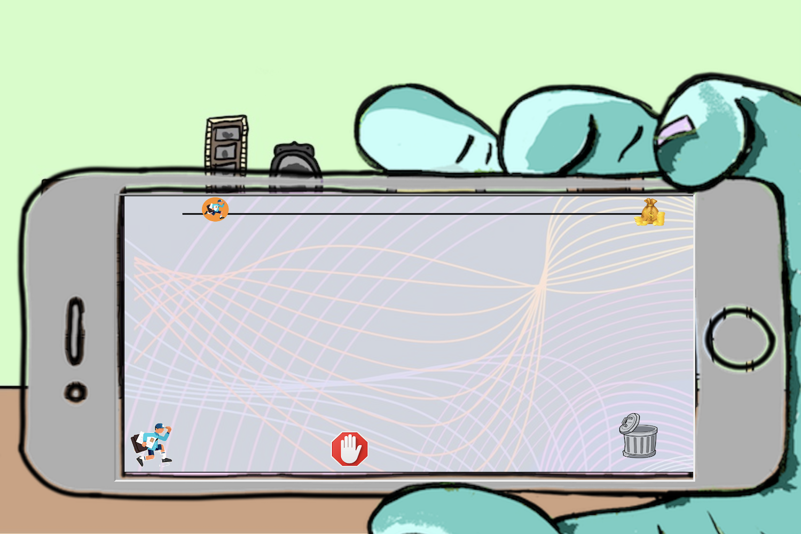

<h2 align="center"> Interactive Research Supplement </h2>

  <div align="center">
  <a href="https://github.com/othneildrew/Best-README-Template">
    
  </a>
  <br />
</div>
  
<h2 align="center"> Web App w/ 3 Arcade Games Themed to Major Research Takeaways </h2>

<p align="center">
<i> Programmed a website as an accessory to the research paper, an interactive experience for exploring the real-world consequences and situations that arise as a result of personalization algorithms </i>
  </p>


## Built With

![HTML][HTML.ico]
![CSS][CSS.ico]
![Javascript][JS.ico]


## About the Project

### Context

DIG 404, the digital studies seminar at Davidson, is entirely focused around the progression and completion of one project over the course of the semester. 

### Research Prompt

Projects are completed independently and center around research that will be conducted on a chosen topic relevant to persuasion architecture, the concept of making design choices to best "persuade" or influence a user to take a certain action. This is most commonly seen with social media ads today, where ads are personalized to the user depending on their activity history or profile, so they only receive ads for products their profile indicates they would be likely to buy. 

### Project Deliverables

The research is outlined and detailled in the required research paper for the project, and is supplemented with a digital "interactive experience" or game relevant to the research topic. Essentially, the interactive experience aims to emphasize or highlight the main takeaways from the research, typically through the use of more pathos.

## App Overview

### Concept

### Structure

User begins at Home page and can navigate to any of three mini-games. The games are accessed through the Home page, the only page of the app, by , selecting one of the corresponding icon buttons to load its respective game within the defined game area of the Home page. Separate pages are not used to host the games, so accessing them requires navigating sequentially, closing the active game and returning to the Home screen before loading a different one. The sequential-stepped one-page structure of the site intends to evoke more of an interactive narrative feel.
<br />

<pre>
#root
├── landing page
    └── home page
        ├── doodle jump
        ├── frogger
        ├── running man
</pre>

### Games

The app consists of three web games, each styled/modelled off a classic arcade game and tweaked to be relevant to the themes of my research. Each game was coded using vanilla Javascript, mainly utilizing the canvas element, and without external libraries or Javascript game engines.

||||
|:-:|:-:|:-:|
|<sup>Frogger</sup>|<sup>Doodle Jump</sup>|<sup>Running Man</sup>|


<h4 align="left">Frogger</h4>

<h5>&ensp;&ensp;&ensp;&ensp;Concept</h5>

<h5>&ensp;&ensp;&ensp;&ensp;Code Snippet</h5>

```js
/** Populates the rows with obstacles */

function loop(){

  [...]

}
  ```

<h4 align="left">Doodle Jump</h4>

<h5>&ensp;&ensp;&ensp;&ensp;Concept</h5>

<h5>&ensp;&ensp;&ensp;&ensp;Code Snippet</h5>


<h4 align="left">Running Man</h4>

<h5>&ensp;&ensp;&ensp;&ensp;Concept</h5>

<h5>&ensp;&ensp;&ensp;&ensp;Code Snippet</h5>


### Art/Graphics


***

[HTML.ico]: https://img.shields.io/badge/html5-%23E34F26.svg?style=for-the-badge&logo=html5&logoColor=white
[CSS.ico]: https://img.shields.io/badge/css3-%231572B6.svg?style=for-the-badge&logo=css3&logoColor=white
[JS.ico]: https://img.shields.io/badge/javascript-%23323330.svg?style=for-the-badge&logo=javascript&logoColor=%23F7DF1E

