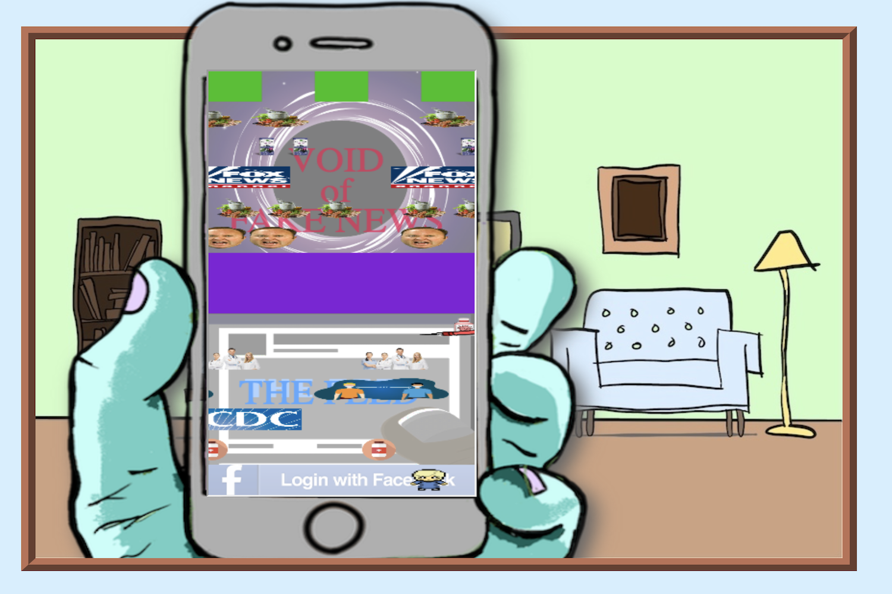

<div align="center">
  <a href="https://github.com/othneildrew/Best-README-Template">
    
  </a>
  <br />
  
  $$ \color{gray}landing &ensp;page $$
  
  <h1 align="center">Supplemental Web Game to Personalization Research  </h1>

  <p align="center">
    Developed a website consisting of three classic arcade game spin-offs themed to be relevant to the topic of my research
    <br />
    <a href="https://github.com/owscork/dig-web-game"><strong>Explore the docs »</strong></a>
    <br />
    <br />
  </p>
</div>


## Built With

![HTML][HTML.ico]
![CSS][CSS.ico]
![Javascript][JS.ico]


## Summary

## App Overview

### Concept

### Structure

User begins at Home page and can navigate to any of three mini-games. The games are accessed through the Home page, the only page of the app, by selecting one of the corresponding icon buttons to load its respective game within the defined game area of the Home page. Separate pages are not used to host the games, so accessing them requires navigating sequentially, closing the active game and returning to the Home screen before loading a different one. The sequential-stepped one-page structure of the site intends to evoke more of an interactive narrative feel.
<br />

<pre>
#root
├── landing page
    └── home page
        ├── doodle jump
        ├── frogger
        ├── running man
</pre>

### Games

The app consists of three web games, each styled/modelled off a classic arcade game and tweaked to be relevant to the themes of my research. Each game was coded using vanilla Javascript, mainly utilizing the canvas element, and without external libraries or Javascript game engines.

<p align="center">
  
  
  
</p>


  $$ \color{gray}frogger  &ensp;&ensp;&ensp;&ensp;&ensp;&ensp;&ensp;&ensp;&ensp;&ensp;&ensp;&ensp;&ensp;&ensp;&ensp;&ensp;&ensp;&ensp;&ensp;&ensp;&ensp; 
  doodle &ensp; jump &ensp;&ensp;&ensp;&ensp;&ensp;&ensp;&ensp;&ensp;&ensp;&ensp;&ensp;&ensp;&ensp;&ensp;&ensp;&ensp;&ensp;&ensp;&ensp;&ensp;&ensp;
  running &ensp; man $$


<h4 align="left">Frogger</h4>

<h6>&ensp;&ensp;&ensp;&ensp;Concept</h6>

<h6>&ensp;&ensp;&ensp;&ensp;Code Snippet</h6>

```js
/** Populates the rows with obstacles */
function loop(){

  [...]
  
  for (let r = 0; r < rows.length; r++) {
    const row = rows[r];
    for (let i = 0; i < row.length; i++) {
      const sprite = row[i];
      sprite.x += sprite.speed;
      sprite.render();

  [...]

}
  ```

<h4 align="left">Doodle Jump</h4>

<h6>&ensp;&ensp;&ensp;&ensp;Concept</h6>

<h6>&ensp;&ensp;&ensp;&ensp;Code Snippet</h6>


<h4 align="left">Running Man</h4>

<h6>&ensp;&ensp;&ensp;&ensp;Concept</h6>

<h6>&ensp;&ensp;&ensp;&ensp;Code Snippet</h6>


### Art/Graphics


***

[HTML.ico]: https://img.shields.io/badge/html5-%23E34F26.svg?style=for-the-badge&logo=html5&logoColor=white
[CSS.ico]: https://img.shields.io/badge/css3-%231572B6.svg?style=for-the-badge&logo=css3&logoColor=white
[JS.ico]: https://img.shields.io/badge/javascript-%23323330.svg?style=for-the-badge&logo=javascript&logoColor=%23F7DF1E

